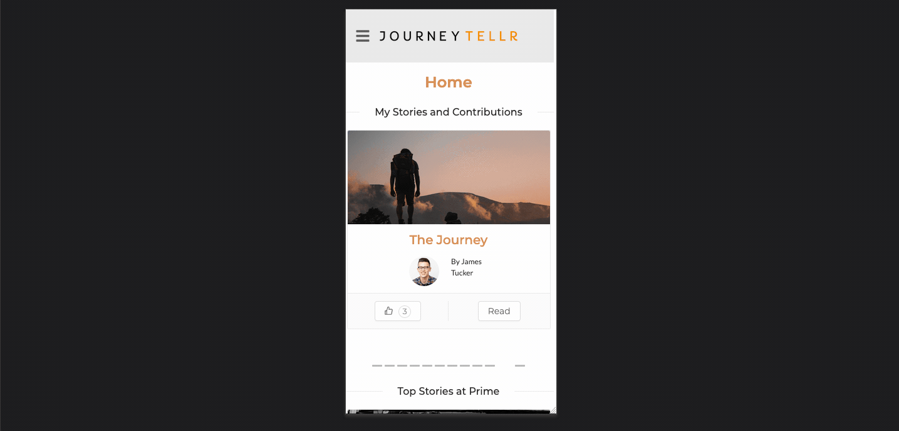
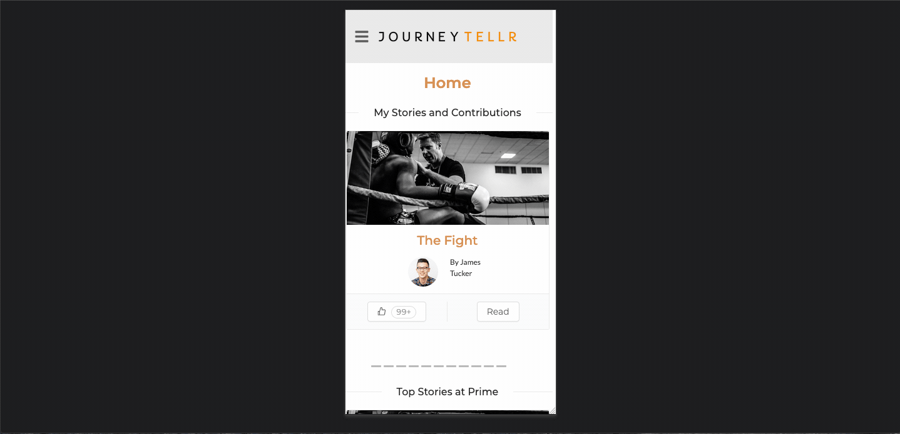
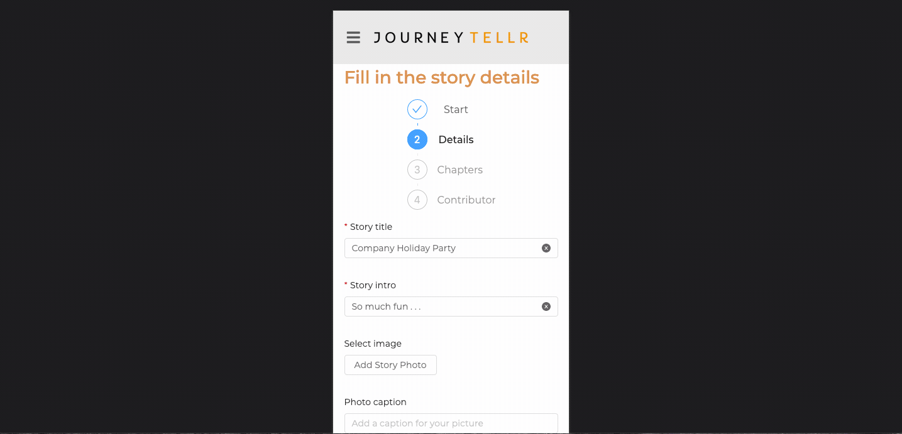
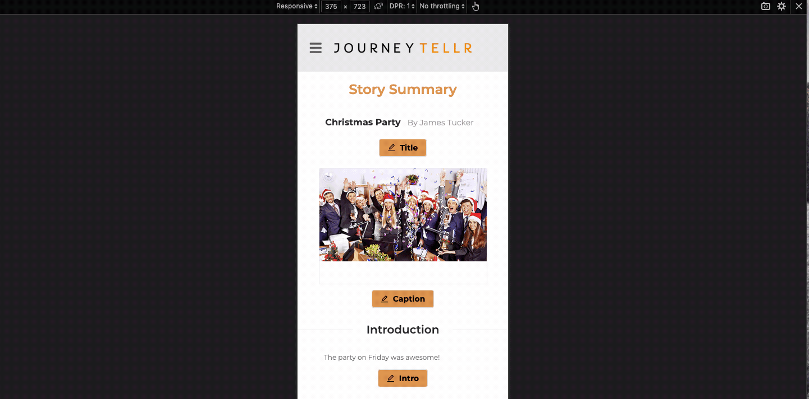

# JourneyTellr

Turn authentic user experiences into seamless content that allows users to connect and easily tell their stories

This version uses React, Redux, Express, Passport, and PostgreSQL (a full list of dependencies can be found in `package.json`).

## Prerequisites

Before you get started, make sure you have the following software installed on your computer:

- [Node.js](https://nodejs.org/en/)
- [PostrgeSQL](https://www.postgresql.org/)
- [Nodemon](https://nodemon.io/)

## Setup

1. Fork and clone this repository.

```bash
npm install 
npm run server
npm run client
```
2. Set up a PostgreSQL database using the project's database.sql file.

## Features

### Home Page



### Create A Story



### Upload Images



### Search Stories


### Notifications



### View/Edit Profile


## Contributors

https://github.com/jamesctucker.png

## Contributing

Pull requests are welcome. For major changes, please open an issue first to discuss what you would like to change.

Please make sure to update tests as appropriate.

## License
[MIT](https://choosealicense.com/licenses/mit/)
